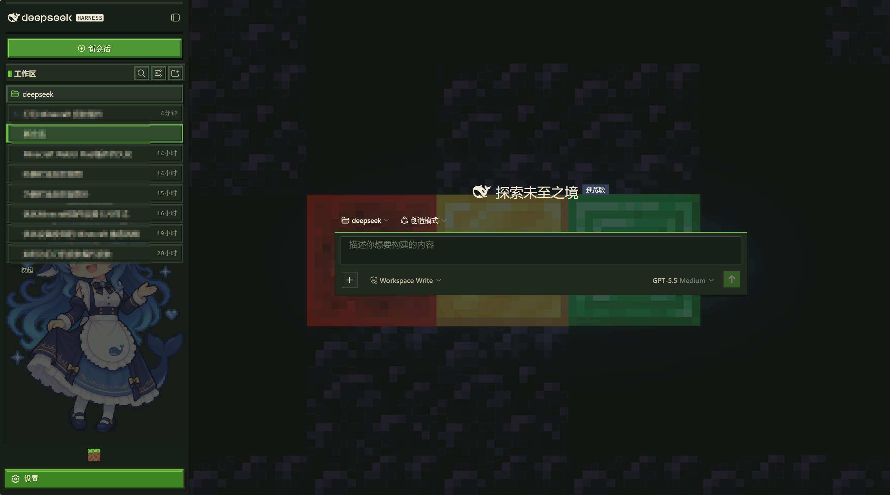
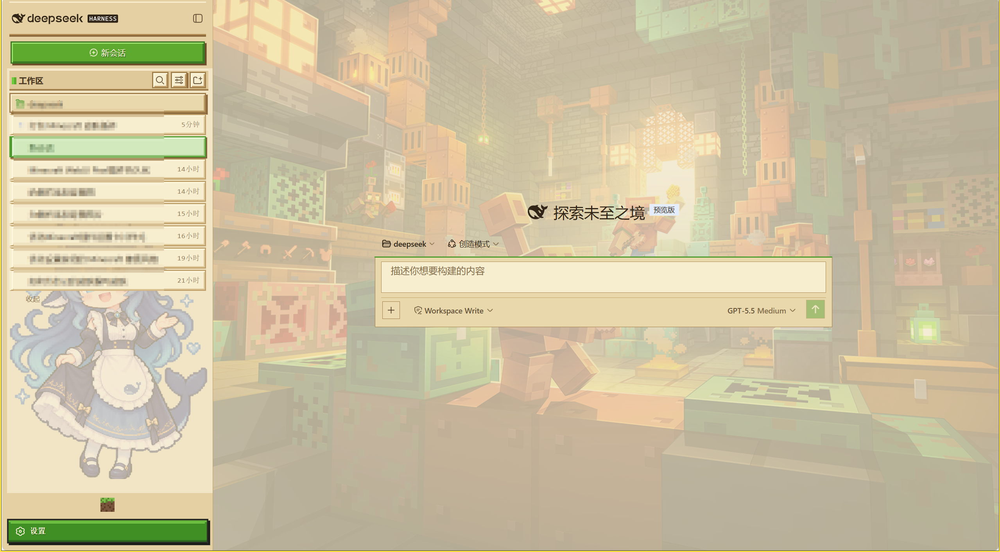

<div align="center">

# Minecraft Pixel Skin

**Minecraft Launcher 风格的 DeepSeek Harness WebUI 皮肤插件**

</div>

## 这是什么

Minecraft Pixel Skin 是一套面向 DeepSeek Harness WebUI 的 Minecraft 像素风皮肤。它将界面改造成 Minecraft Launcher 风格，使用草方块绿、泥土棕、木板和石材等视觉元素，提供硬朗的方块边框、像素化背景、像素按钮和侧边栏装饰，并同时适配暗色模式与亮色模式。

## 预览

| 暗色模式 | 亮色模式 |
| --- | --- |
|  |  |

## 安装

在 DeepSeek Harness 根目录执行以下命令，将此插件安装到 Web profile：

```sh
dsh plugin --profile web add https://github.com/EDMOK/dsh-minecraft-theme.git
```

如果目标 profile 不是 `web`，将 `--profile web` 替换为实际 profile 名称。安装完成后刷新 WebUI，皮肤即可生效。

## 版权信息

| 版权所有人 | 版权所有内容 | 个人主页 |
|---|---|---|
| 上善 | 鲸鱼娘角色形象原作 | [Pixiv](https://www.pixiv.net/users/62155430) · [Bilibili（上善无形）](https://b23.tv/8h5L4xz) |

Minecraft 相关元素归 Mojang Studios、Microsoft 及其相关权利人所有；鲸鱼娘角色形象原作归上善所有。

本项目原创的界面设计、视觉整合、样式调整及说明内容采用 [CC BY-NC-SA 4.0](https://creativecommons.org/licenses/by-nc-sa/4.0/deed.zh-hans) 许可。欢迎署名、非商业使用与相同方式共享；转载或再创作时，请保留本项目及原作的版权信息。

代码部分的许可请参见 [`LICENSE`](./LICENSE)。
